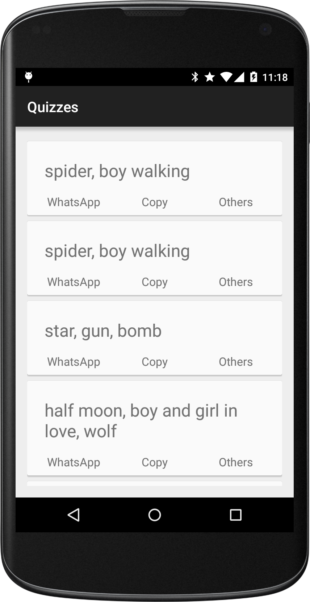

Just an Android sample app that shows a [Recycler View] populated with cards, that is, [Card Views]. Using appcompat-v7, and minSdkVersion 14, the standard setup these days (Apr 2015).

This app contains pretty much the minimum amount of code you can have:

[Recycler View]:https://developer.android.com/reference/android/support/v7/widget/RecyclerView.html
[Card Views]:https://developer.android.com/reference/android/support/v7/widget/CardView.html
